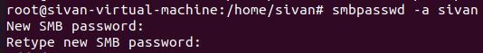
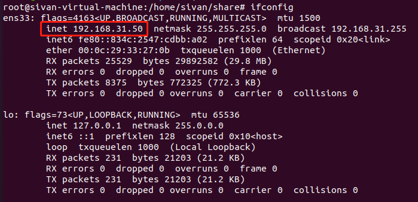
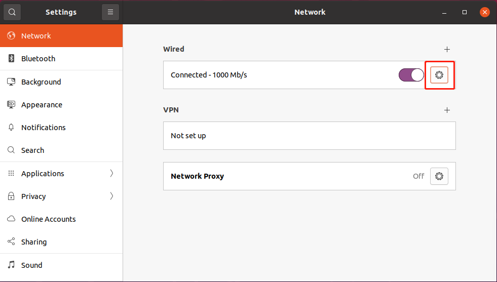
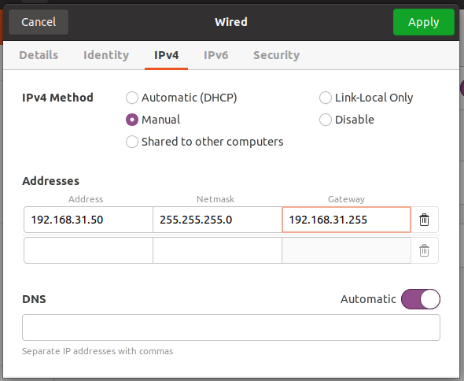
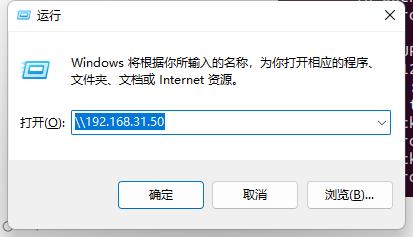

# 安装Samba


## 1.安装samba

`sudo apt-get install samba samba-common` 

输入密码后等待安装完成


## 2.创建一个共享文件夹，并设置权限

`mkdir /home/sivan/share/`

`chmod 777 /home/sivan/share/`


## 3.添加用户及密码

指令：`sudo smbpasswd -a [用户名]`



输入密码，密码会输入俩次。

## 4.修改配置文件

`sudo vi /etc/samba/smb.conf`

在配置文件的最后添加如下：

```
[share]
comment = share folder
browseable = yes
path = /home/sivan/share
create mask = 0700
directory mask = 0700
valid users = sivan
force user = sivan
force group = sivan
public = yes
available = yes
writable = yes
```


## 5.重启Samba

`sudo service smbd restart`


## 6.ip地址操作

使用ifconfig可以查看ip地址

`ifconfig`




## 7.设置静态IP



选择手动，填写好相关参数。192.168.31.xxx和电脑主机保持在同一网段。




## 8.在Windows中访问共享文件夹




**END.**


作者：郭锋

日期：2022年7月19日
