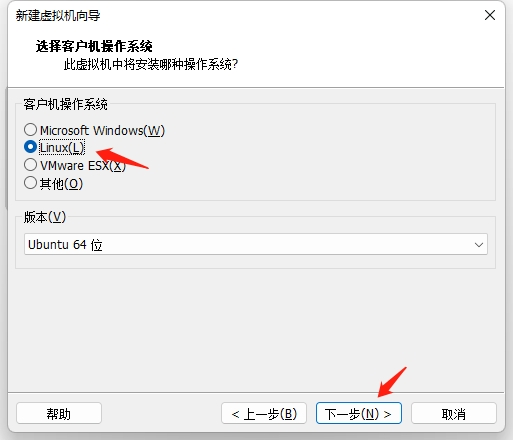

# Unbuntu安装

1、 下载ubuntu-20.04.4-desktop-amd64.iso镜像文件：[Ubuntu 20.04.4 LTS (Focal Fossa)](https://releases.ubuntu.com/20.04/)

 

2、 打开VMware，点击 创建新的虚拟机。

 

3、 选择 经典， 点击 下一步。

 


4、然后选择 稍候安装操作系统，点击 下一步

 

 

4、 选择Linux， 版本选择Ubuntu64位，点击下一步。

 

5、 取一个虚拟机的名字，选着虚拟机文件存放的位置，然后点击 下一步

 

 

6、这里建议给磁盘大小设置的大一些，因为随着我们在Ubuntu上安装软件以及学习占据的空间会越来越大，然后点击-->将虚拟磁盘存储为单个文件，点击下一步

 

7、选择 自义定硬件

 

 

8、内存建议8G

 

 

9、处理器最少2核

 

 

10、网络适配器选择桥接模式

 

 

11、使用ISO映像文件，点击浏览，选择刚刚下载好的Ubuntu系统镜像的压缩包，点击关闭，完成虚拟机创建。

 


1、 点击开启虚拟机，安装Ubuntu。

 

 

2、 选择Enlight，然后点击install Ubuntu

 


3、 键盘布局选择English（US），双击可以进入下一步

 

 

4、 选择正常安装，安装Ubuntu时下载更新

 

5、 如图选择，并点击现在安装

 

 

6、 点击地图中的中国区域，默认选择上海，点击继续

 


7、 设置好自己的用户名，其他电脑访问你时的名字以及密码，点击需要使用密码登录，点击继续，正式开始安装。

 


# 更新源

```
sudo su					#进入Root权限下
apt-get update			#更新源
apt-get upgrade		  	#更新软件
apt-get clean           #清理缓存
```


# 安装VIM

`apt-get install vim`


# 基础环境安装

```
sudo apt-get install gcc

sudo apt-get install g++

sudo apt-get install make
```


# 交叉编译链安装

1.交叉编译器的下载

[Linaro Releases](https://releases.linaro.org/components/toolchain/binaries/7.5-2019.12/arm-linux-gnueabi/)


2.解压工具链

`tar xvf gcc-linaro-7.5.0-2019.12-x86_64_arm-linux-gnueabi.tar.tar	#解压`


3.把交叉编译工具添加进环境变量中

`vi ~/.bashrc	#修改环境变量PATH，让系统先去指定目录寻找交叉编译链的可执行文件`


在.bashrc文件末尾加上下面这行，根据自己的解压目录修改路径

export PATH=/home/ubuntu/gcc-linaro-7.5.0-2019.12-x86_64_arm-linux-gnueabi/bin:$PATH


4.让.bashrc生效

`source ~/.bashrc	`


5.检验是否安装成功

`arm-linux-gnueabi-gcc -v		#使用该指令检验交叉工具链是否安装成功`


6.安装相关依赖库

```
sudo apt-get install libglib2.0-dev
sudo apt-get install libpixman-1-dev
```


**END.**


作者：郭锋

日期：2022年7月19日
