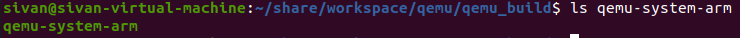
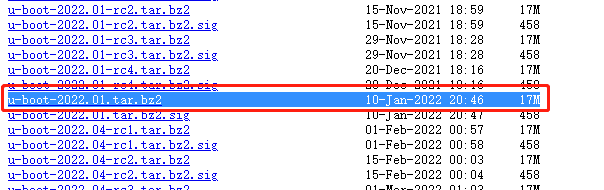
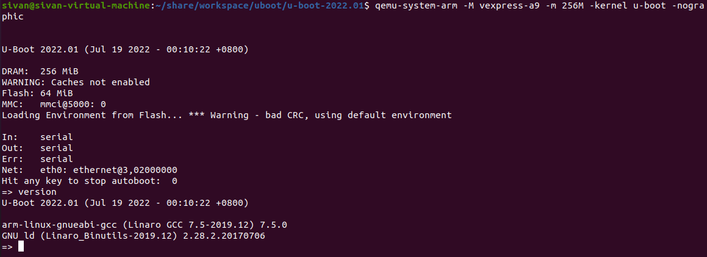

系统版本：Ubuntu Server 20.04 LTS 64bit

交叉编译器：arm-linux-gnueabi-gcc  (Linaro GCC 7.5-2019.12)  7.5.0

QEMU：7.0.0

ninja-build：1.10.0


# 编译并安装QEMU

1.安装相关依赖

```
sudo apt-get install ninja-build	
```


2.下载QEMU7.0.0源码

```
wget https://download.qemu.org/qemu-7.0.0.tar.xz
```


3.解压下载的源码

```
tar xvf qemu-7.0.0.tar.xz
```


4.在下载目录新建 build 文件夹

```
mkdir qemu_build && cd qemu_build
```


5.切换到root模式，并进行编译安装。

```
sudo su

../qemu-7.0.0/configure

make && make install
```


编译成功后，qemu-system-arm就生成在当前目录




# Uboot编译


1.安装相关依赖

```
sudo apt-get install bison flex
sudo apt-get install libssl-dev
```


2.在该网址中下载对应版本的Uboot源码

[Index of /pub/u-boot/ (denx.de)](https://ftp.denx.de/pub/u-boot/)




3.将下载的源码解压开来

`tar xvf u-boot-2022.01.tar.bz2`


4.首先进入uboot根目录, 执行

```
make ARCH=arm CROSS_COMPILE=arm-linux-gnueabi- vexpress_ca9x4_defconfig	# 加载板子的配置信息

make ARCH=arm CROSS_COMPILE=arm-linux-gnueabi- -j8		# 多线程编译
```


# 使用 QEMU 仿真运行Uboot

```undefined
qemu-system-arm -M vexpress-a9 -m 256M -kernel u-boot -nographic
```

- -M 指定了主板类型, 和上面编译的 uboot 主板参数一致
- -m 表示主板的 DRAM 大小
- -kernel 后面的可执行文件会被QEMU直接加载到内存并执行, 这里等效于 `-device loader,file=u-boot,cpu-num=0`
- -nographic 表示不启动图形界面




**[注]:** 先按 Ctrl-A 进入QEMU的功能选择模式, 然后按 x 退出.
**[提示]:** Ctrl-A 后按 ? 可查看有哪些功能选项.


**END.**


作者：郭锋

日期：2022年7月19日
