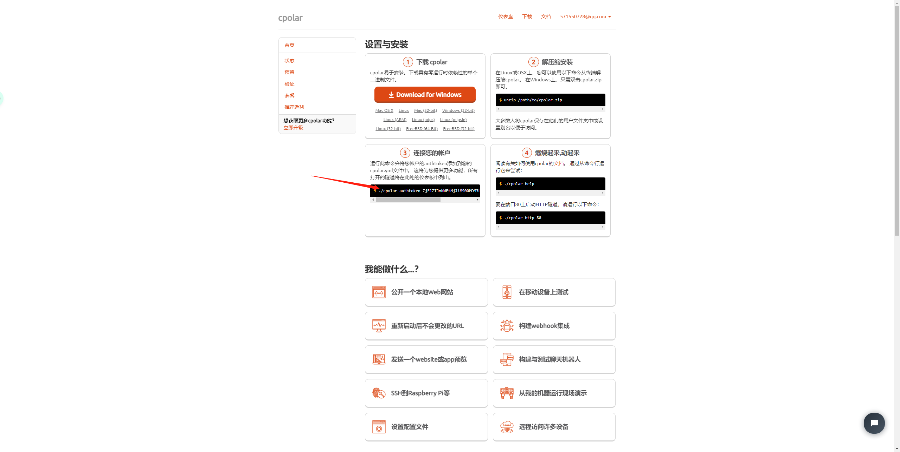
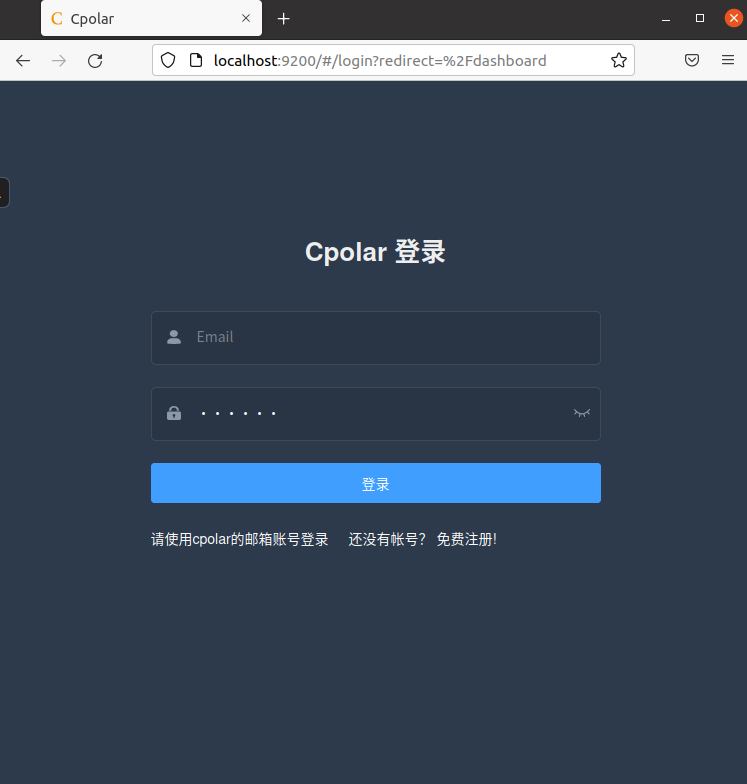
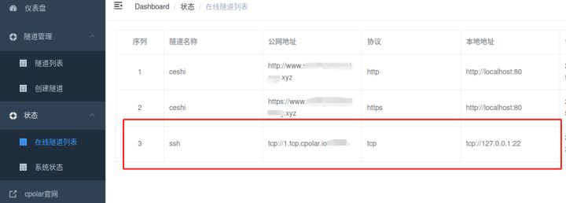

如果想要在外面连接家里的电脑，但是又申请不到公网ip，那么可以试试用cploar进行内网穿透。

以下介绍通过cpolar内网穿透来实现外网远程ssh登录ubuntu：

# 1、安装和启动ssh

```
sudo apt-get install openssh-server
service sshd start
```

# 2、注册并安装cpolar内网穿透

## 2.1 cpolar 安装（国内使用）

```
curl -L https://www.cpolar.com/static/downloads/install-release-cpolar.sh | sudo bash
```

## 2.2 token认证

登录[后台](https://www.cpolar.com/)，查看自己的认证token，之后将token贴在命令行里



```
cpolar authtoken xxxxxxx
```

## 2.3 启动cpolar服务

```
sudo systemctl start cpolar
```

## 2.4 查看服务状态

```
sudo systemctl status cpolar
```

# 3、获取ssh隧道的公网地址

## 3.1 登录cpolar web UI管理界面

在**linux**系统的浏览器访问：http://localhost:9200/，输入所注册的cpolar账号密码，登录cpolar web UI管理界面



## 3.2 查看ssh隧道所映射的公网地址

cpolar会默认安装ssh隧道，指向22端口，tcp协议。在启动服务后，即会自动生成公网地址。

1. 左侧仪表盘——隧道列表——启动ssh隧道

2. 左侧仪表盘——状态——在线隧道列表

3. 获取`ssh隧道`的公网地址

   

# 4、外网远程ssh访问内网的ubuntu

控制端电脑打开终端命令行，输入命令，远程ssh访问局域网内的ubuntu。

```
ssh ubuntu的用户名@cpolar公网地址 -p XXXXX（cpolar生成的端口号）
```

如cpolar已经将本地22端口映射到了20013端口，所以，ssh命令需要加-p参数，后面加公网隧道端口号

示例：

```
ssh liaowx@2.tcp.vip.cpolar.cn -p 20013
```

在输入正确的命令后，Ubuntu会出现提示信息，询问是否确定连接该端口，并要求输入Ubuntu系统的密码，此时分别输入“yes”和ubunt系统密码即可。


# 5、另外

免费版本的cploar，每过24小时，端口号会改变。需要重新配置。


作者：廖文雄

日期：2022-07-18